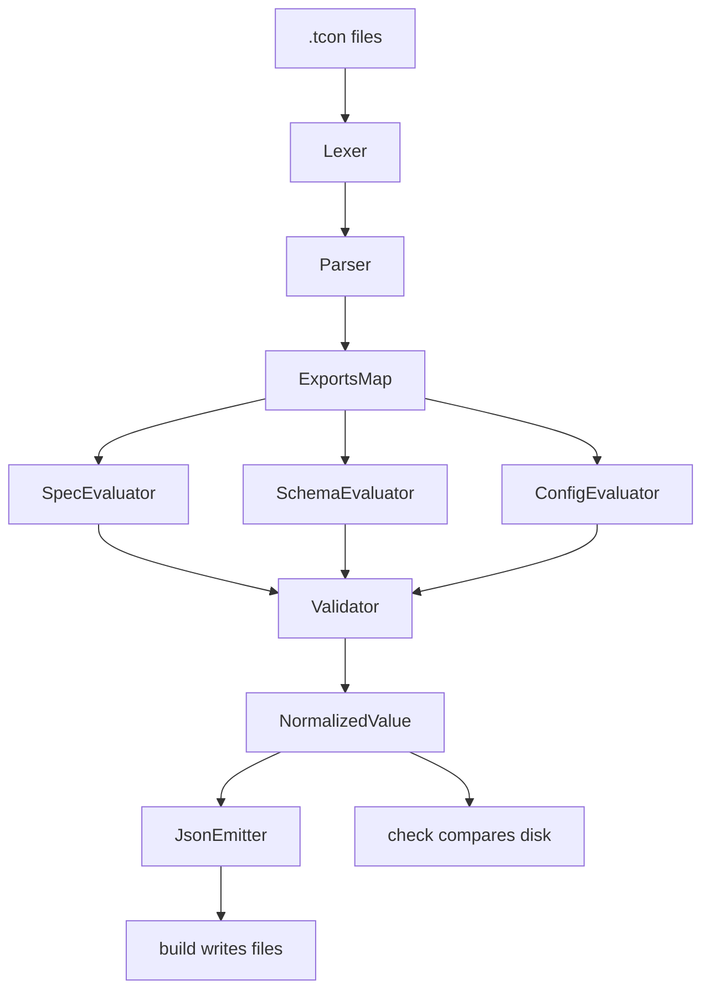

# AGENTS.md

## Mission

`tcon` compiles typed `.tcon` files into deterministic config artifacts and prevents drift between source-of-truth definitions and generated files.

This repository is intentionally zero-dependency and should remain small, explicit, and auditable.

## Non-negotiable Constraints

- Keep runtime dependencies at zero unless explicitly approved.
- Preserve deterministic output ordering across platforms.
- Never execute arbitrary user code from `.tcon`; only parse and evaluate supported DSL nodes.
- Favor clear compile-time diagnostics over implicit behavior.

## DSL Contract

### Required exports

Every entry file must provide:

- `export const spec = ...`
- `export const schema = ...`
- `export const config = ...`

### Allowed syntax (MVP)

- `export const` declarations
- object literals, array literals, primitive literals
- member access and call chains for schema declarations
- comments (`//` and `/* ... */`)

### Disallowed syntax (MVP)

- imports/exports beyond `export const`
- functions, loops, conditionals
- spreads, computed properties
- arbitrary expressions and operators

## System Architecture

## Phase Boundaries and Data Contracts

- `lexer`: source text -> token stream
- `parser`: token stream -> AST (`Expr`, `ExportConst`, `Program`)
- `loader`: file IO + parse + export map
- `eval/spec_eval`: export `spec` -> `Spec { path, format, mode }`
- `eval/schema_eval`: schema DSL -> `Schema`
- `eval/config_eval`: config literals -> `Value`
- `validate/validator`: `Schema + Value` -> normalized `Value` (defaults, strict handling, type checks)
- `emit/json`: normalized `Value` -> deterministic JSON string
- `diff`: expected-vs-actual drift messaging

## CLI Command Semantics

- `tcon build [--entry <file.tcon>]`
  - Compiles one or all entries.
  - Writes generated files under paths defined in `spec.path`.
  - Exit `0` on success, non-zero on any compile/validation/write error.
- `tcon check [--entry <file.tcon>]`
  - Recomputes deterministic output and compares with on-disk files.
  - Exit `0` when no drift exists.
  - Exit non-zero when any file differs or fails to compile.
- `tcon diff [--entry <file.tcon>]`
  - Prints first-difference summaries for files with drift.
  - Exit `0` when there are no differences.
  - Exit non-zero when differences exist.
- `tcon print --entry <file.tcon>`
  - Prints parsed export expressions for debugging parser output.
- `tcon watch [--entry <file.tcon>]`
  - Runs an initial build, then rebuilds when `.tcon` entry file mtimes change.

## Implemented Scope

- Output formats: JSON, YAML, ENV.
- Schema roots: `t.string()`, `t.number()`, `t.boolean()`/`t.bool()`, `t.object({...})`, `t.array(...)`.
- Supported modifiers: `.default(value)`, `.optional()`, `.min(n)`, `.max(n)`, `.int()`, `.strict()`.
- Imports: `import { symbol } from "./other.tcon";` with cycle detection and symbol validation.

## Contributor Workflow

- Implement vertical slices that pass end-to-end (`parse -> eval -> validate -> emit`).
- Keep parser and evaluator deterministic and explicit; reject unsupported forms with actionable errors.
- Add fixture-driven tests for:
  - happy-path compile cases
  - deterministic key ordering
  - strict mode behavior
  - default application
  - drift detection behavior

## Quality Gates

- Diagnostics identify file and failing path/stage.
- JSON emitter output is stable across runs and OSes.
- `check` behavior is regression tested against expected drift cases.
- Any new DSL feature must document:
  - syntax accepted
  - evaluator semantics
  - validation behavior
  - deterministic guarantees

## Roadmap

1. Improve diff UX beyond first-difference output.
2. Expand watch mode to track imported dependency files transitively.
3. Add richer parser diagnostics with line/column snippets.
4. Extend schema DSL (union/enum/record) while preserving deterministic output.
